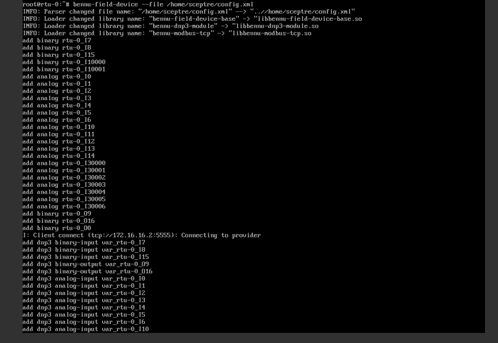
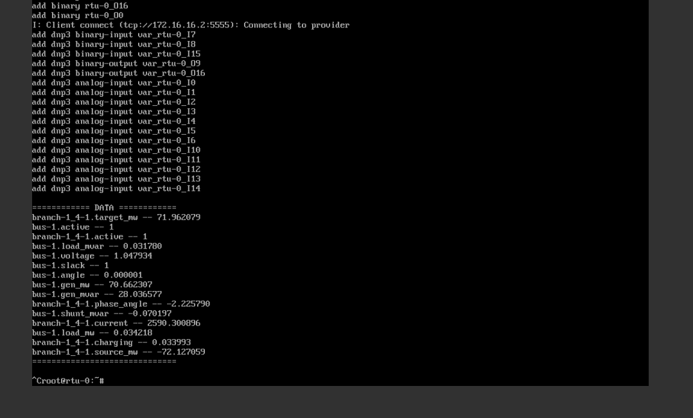
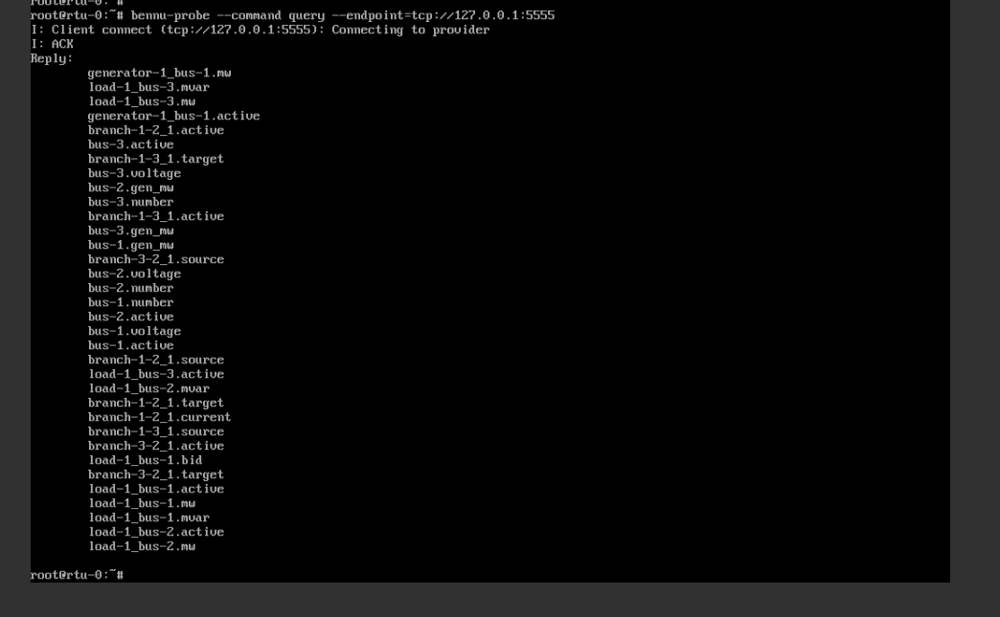
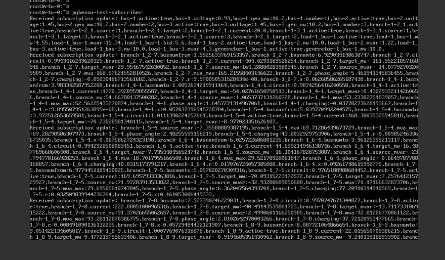

# bennu
Bennu and Pybennu are both installed on the `bennu.qc2` image that is used for most virtual RTUs in SCEPTRE.

Both of these programs have some useful command line executables that can be used in SCEPTRE experiments to troubleshoot or force changes in the experiment.

## Bennu CLI

### bennu-brash

- Quick access to the brash UI on bennu
- This is the default login shell for the `sceptre` user, e.g. if connected to the field device with SSH and username `sceptre`
- Example: `bennu-brash`

### bennu-field-device

- Used to start a bennu-field-device simulation based on a given config. It will periodically output its current state for the tags detailed in the config
- Will print out the current values of the tags specified in the config
- Use `--help` to get options
- Use `--file` to specify the config you want to use
- Example: `bennu-field-device --file /home/sceptre/config.xml`

### bennu-probe

- Command line probe for querying/reading/writing values to/from a bennu field device or provider
- Useful for affecting specifc tags on a device
- Use `--help` to get all options
    - Note for the specific examples below, a server needs to be running on the field device hence the endpoint being the loopback address
- Query example: `bennu-probe --command query --endpoint=tcp://127.0.0.1:5555`
- Read example: `bennu-probe --command read --tag bus-1.active --endpoint=tcp://127.0.0.1:5555`
- Write example: `bennu-probe --command write --tag bus-1.active --status false --endpoint=tcp://127.0.0.1:5555`

### bennu-simulink-provider

- Starts the simulink provider
- This is not usually invoked by users, and is usually invoked by a startup script injected by the SCEPTRE app.

### bennu-field-deviced

- Simulate running a bennu field device with a given config file. Useful when testing new or custom bennu rtu configs
- This tool has slightly more functionality than `bennu-field-device` as it can be run as a daemon
- Use `--help` to get all options
- Must give a `--command` argument of start, stop, or restart
- `--env` gives the option to give the simulation a string identifier
- Start example: `bennu-field-deviced --command start --file /home/sceptre/new_config.xml`

### bennu-watcherd

- A watcher for a basic field-device daemon in bennu
- This is automatically started by a script injected by the SCEPTRE app.

### bennu-test-bp-server

- Batch process test worker service
- A test server and provider with predefined points which can be used for testing once it is running
- Use `--help` to get all options
- For example, can be run and then probed by bennu-probe
- Example: `bennu-test-bp-server`

### Bennu-test-ep-server

- Electric process test worker service
- Same as above, may be more useful as the predefined tags are more power related
- Use `--help` to get all options
- Example: `bennu-test-ep-server`

## Pybennu CLI

### pybennu-probe

- Very similar to `bennu-probe` but written in Python
- Use `-h` to get all options
    - Note for the specific examples below, a server needs to be running on the field device hence the endpoint being the loopback address
- Query example: `pybennu-probe -c query -e=tcp://127.0.0.1:5555`
- Read example: `pybennu-probe -c read -t bus-1.active -e=tcp://127.0.0.1:5555`
- Write example: `pybennu-probe -c write -t bus-1.active -s 0 -e=tcp://127.0.0.1:5555`

### pybennu-test-ep-server

- Similar to above, this preforms essentially the same functionality as `bennu-test-ep-server`
- Use `-h` to get all options
- Example: `pybennu-test-ep-server`

### pybennu-test-subscriber

- This feature subscribes to a running server/publisher and will print the published points to the screen
- Good for debugging and making sure that a publisher is giving the expected values for multiple tags in real time.
- Use `-h` to get all options
    - Note for the specific examples below, a server needs to be running on the field device hence the endpoint being the loopback address
- Run with no options: `pybennu-test-subscriber`

### pybennu-power-solver

- This runs the power daemon code that is written for pybennu
- It requires a `.ini` config file to run (usually named `config.ini`)
- The `.ini` file requires specifying how the power daemon will run and which power provider will be monitored and started by the daemon
- This is usually run by a startup script injected by the SCEPTRE app

### pybennu-siren

- This runs the siren feature of pybennu used for HIL
- Needs a `-c` config file and `-d` array of devices listed in the config file
- This will launch siren according to the config

## Logs
- To get logs from startup scripts: `journalctl -u phenix`
